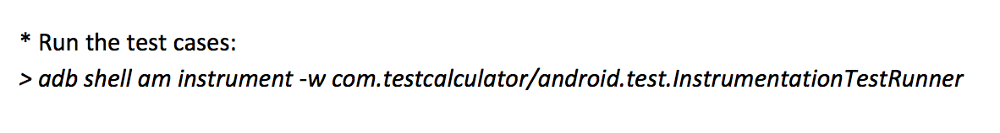
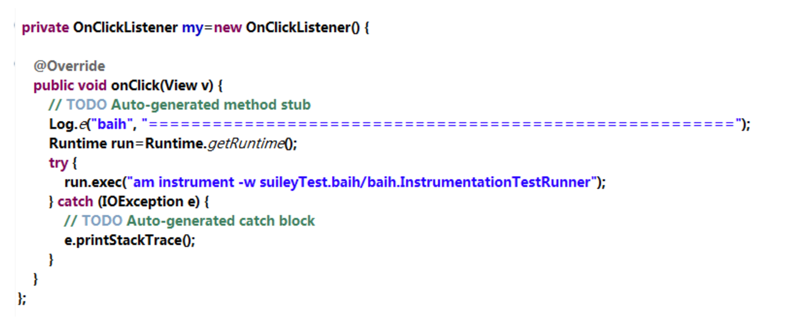

# TestRobotium
Run Robotium scripts directly in device

# 方案
创建Apk启动命令行
既然启动测试Apk的命令为:``



那么再创建一个Apk在Android的命令行中运行该命令即可脱离PC。




参考文章: https://www.cnblogs.com/cologne/p/3796408.html

# 只有apk时robotium创建测试工程
- [教程](TestAndroidCalculatorAPK-BlackBoxTesting-V2_0.pdf)

# 注意点
- 使用re-sign.jar时用`java -jar re-sign.jar`打开，否则提示没有设置JAVA_HOME
- 与大家分享robotium一个小问题。Test run failed：Instrumentation run failed due to 'java.lang.ClassNotFoundException'，是因为re-sign给出来的Activity有误，使用`aapt dump badging NotePad.apk`重新取出正确的Activity。
- 选用重写的instrumentationRunner时需要先修改Manifest的instrumentation标签instrumentationRunner为自己重写的那个，然后再改run configurations
- 在17及以上版本，命令中需要加入--user 0参数
```
adb shell am instrument --user 0 -w packagename/InstrumentationTestRunnername
```
